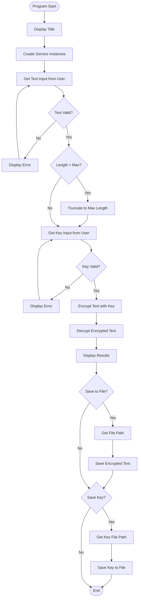

# textEncryption

Learning project to build a simple CLI text encryption tool. The aim is to practice designing a basic encryption algorithm, wire it into a .NET console app, and print the encrypted text back to the user.

## Goals

- Accept text input from the command line.
- Apply a straightforward, custom encryption/obfuscation algorithm.
- Return the encrypted result to the user.
- Serve as a playground to learn and iterate on encryption ideas in .NET.

### Running

Clone and enter the repo:

```sh
git clone https://github.com/your-username/textEncryption.git
cd textEncryption
```

With Nix (preferred; picks .NET 10 or falls back to 9):

```sh
nix develop   # enter shell with the SDK
dotnet run --framework net10.0    # use net9.0 if net10.0 not available
# or just:
nix run .#   # auto-picks net10.0, falls back to net9.0
```

With your locally installed .NET SDK:

```sh
dotnet run --framework net10.0   # or net9.0 if 10 isn't installed
```

### Next Steps

- Implement the encryption algorithm in `Program.cs`.
- Add tests/examples showing input → encrypted output.
- Document the algorithm and its limitations once chosen.

## TODO

### File I/O Enhancements

- [ ] Add menu option to load encrypted text from file
  - Prompt user for file path
  - Load encrypted text using `FileService.LoadEncryptedText()`
  - Prompt for key file path or allow manual key entry
  - Decrypt and display the loaded text
- [ ] Add menu option to load key from file
  - Prompt user for key file path
  - Load key using `FileService.LoadKey()`
  - Use loaded key for encryption/decryption operations

### Algorithm Exploration

- [ ] Research and implement Caesar cipher as an alternative encryption method
  - Learn how Caesar cipher works (shift-based substitution)
  - Compare with XOR encryption (strengths/weaknesses)
  - Consider adding as a second encryption option in the program

## Program Flow


